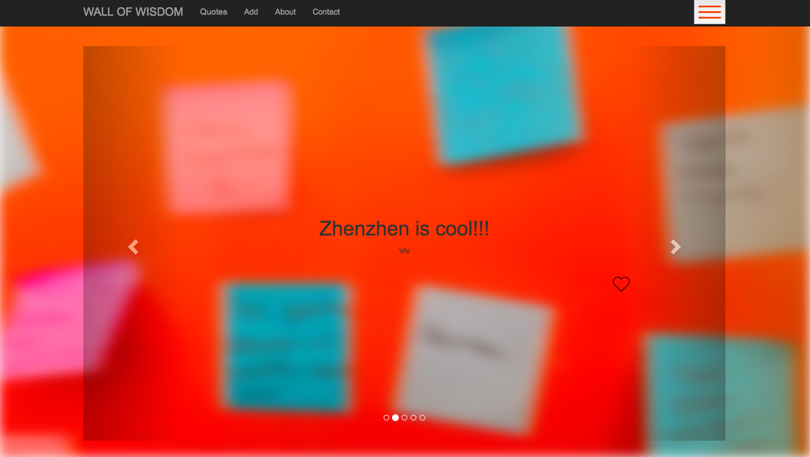
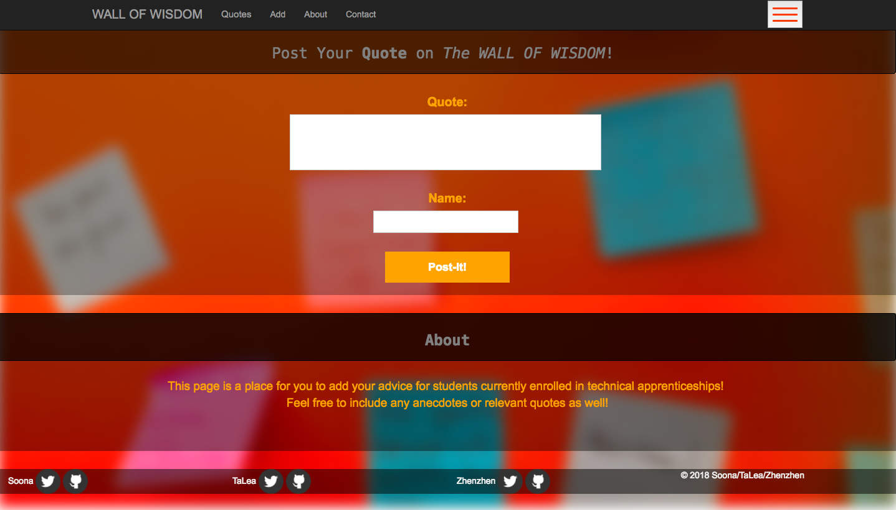

# Techtonica Quotes
<h4>First Group Project at Techtonica</h4>
 
HTML, CSS, Bootstrap, jQuery, Node, Express and MongoDB.

# Wall of Wisdom

<h3>How to Set the Webpage Up:</h3>

The quotes in carousel are linked to MongoDB database. So you have to have MongoDB to set this webpage up.

First, please type `npm install` in your terminal, to install all the node_modules.

Then, after installing MongoDB in your computer, please follow the following steps:

* Step 1: In terminal, type `mongo`. You should see an arrow sign > instead of a dollar sign $. Now you are in mongoDB.
* Step 2: In mongo, type `use quotesapp`.
* Step 3: In mongo, type `db.createCollection('users')`.
* Step 4: In mongo, type `db.users.insert([{name: 'My Name', quote: 'MY Quote 1'}, {name: 'My Name', quote: 'My Quote 2'}])`. You can insert as many objects as you want in this 'users' array, and each object should include two keys, 'name' and 'quote'. 
Or, you can submit your quotes from the webpage after loading the webpage on local host as in Step 6 and Step 7.
* Step 5: In mongo, type `db.users.find()` to see if your quotes are stored in MongoDB database (quotesapp/users).
* Step 6: Go back to terminal, cd to this webpage root directory, and type `node app.js`.
* Step 7: Go to your browser, type `localhost:3000`, then you should see the quotes on WALL OF WISDOM.

Enjoy!

# Roadmap

<h3>About: </h3>

"Wall of Wisdom" is a website that provides technical and motivational advice for coders looking for guidance or a quick "pick me up".

<h3>Functions:</h3>

* Ability to post quotes/advice from contributors.
* Ability to navigate different sections of website.
* Ability to navigate back to "top of page"/homescreen using the home button.
* Ability to "like" quotes/advice.

<h3>1) Navigation Bar:</h3>

* Page title should be a clickable link and allow users to be redirected back to "top of page". 
* Page Title: "Wall of Wisdom".

* Hamburger menu: dropdown menu (for mobile phone) that allows users to navigate different sections of the page. 
* Hover effect that enlarges text when each section in nav bar is hovered over.

<h3>2) Carousel of Quotes:</h3>

* Advice/Quotes go in their own div, the background will be a video.
* Two buttons will be placed here that allow users to shift from one quote to the next (left arrow and right arrow).
* Within this div there will be a heart-shaped button positioned below it.

<h3>3) Post-It! Form:</h3>

* Under this there will be an input form that allows users to add their own advice or favorite quotes. 
* A "submit" button will be included to allow users to submit their content.

* About section will be between form and footer.

<h3>4) Footer:</h3>

* The footer will include a "copy-right" and Github/Twitter links/names of authors.

 
 

<b>Copyright 2018</b>

<a href="https://github.com/zzyou" target="_blank">Zhenzhen You</a>
 
<a href="https://github.com/TaLeaMonet" target="_blank">TaLea Carpenter</a>
 
<a href="https://github.com/SoonaMata" target="_blank">Soona Mata</a>
 
 

  Licensed under the <b>Apache License, Version 2.0</b> (the "License");
you may not use this file except in compliance with the License.
You may obtain a copy of the License at
  
     http://www.apache.org/licenses/LICENSE-2.0

  Unless required by applicable law or agreed to in writing, software
distributed under the License is distributed on an "AS IS" BASIS,
WITHOUT WARRANTIES OR CONDITIONS OF ANY KIND, either express or implied.
See the License for the specific language governing permissions and
limitations under the License.

